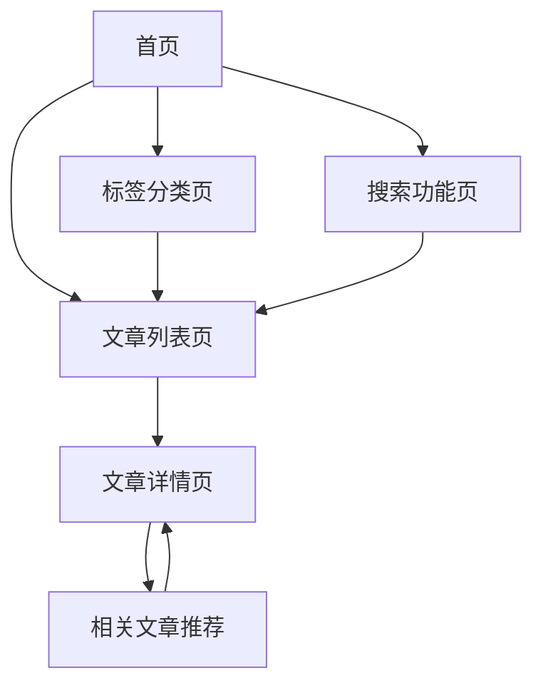

# Binbim Blog 个人博客优化需求文档

## 1. 产品概述

针对 Binbim Blog 个人博客系统进行核心功能优化，专注于提升用户阅读体验和内容展示效果。

* 基于现有 VuePress 架构，保持简洁性的同时增强实用功能

* 优化界面设计和交互体验，提升博客的专业性和美观度

## 2. 核心功能

### 2.1 功能模块

本次优化包含以下核心页面：

1. **首页优化**: 改进布局设计，增加最新文章展示和快速导航
2. **文章列表页**: 增强文章展示效果，添加搜索和筛选功能
3. **文章详情页**: 优化阅读体验，添加目录导航和阅读进度
4. **标签分类页**: 新增标签系统，支持按标签浏览文章
5. **搜索功能页**: 实现全文搜索，快速定位文章内容
6. **统计仪表板**: 添加基础统计功能，包括文章阅读量、访问统计等

### 2.2 页面详情

| 页面名称  | 模块名称  | 功能描述               |
| ----- | ----- | ------------------ |
| 首页优化  | 英雄区域  | 优化视觉设计，添加动态效果和个人介绍 |
| 首页优化  | 最新文章  | 展示最近发布的文章，支持快速预览   |
| 首页优化  | 快速导航  | 添加标签云和分类导航，便于内容发现  |
| 文章列表页 | 搜索功能  | 实现实时搜索，支持标题和内容搜索   |
| 文章列表页 | 标签筛选  | 按标签过滤文章，支持多标签组合筛选  |
| 文章列表页 | 排序功能  | 支持按时间、标题等方式排序文章    |
| 文章详情页 | 目录导航  | 自动生成文章目录，支持锚点跳转    |
| 文章详情页 | 阅读进度  | 显示阅读进度条，提升阅读体验     |
| 文章详情页 | 相关文章  | 基于标签推荐相关文章         |
| 文章详情页 | 阅读统计  | 记录文章阅读量，显示阅读时间     |
| 标签分类页 | 标签云   | 可视化展示所有标签，支持点击筛选   |
| 标签分类页 | 分类统计  | 显示每个标签下的文章数量       |
| 搜索功能页 | 全文搜索  | 搜索文章标题、内容和标签       |
| 搜索功能页 | 搜索建议  | 提供搜索关键词建议和历史记录     |
| 统计仪表板 | 访问统计  | 显示博客总访问量和页面访问统计    |
| 统计仪表板 | 阅读统计  | 展示文章阅读量排行和阅读趋势     |
| 统计仪表板 | 数据可视化 | 使用图表展示统计数据和趋势分析    |

## 3. 核心流程

用户主要操作流程：

1. 访问首页 → 浏览最新文章或使用快速导航
2. 进入文章列表 → 使用搜索或标签筛选找到感兴趣的文章
3. 阅读文章详情 → 使用目录导航和阅读进度功能
4. 通过标签系统 → 发现相关主题的其他文章

## 4. 用户界面设计

### 4.1 设计风格

* **主色调**: 保持现有的绿色主题 (#3eaf7c)，增加渐变效果

* **辅助色**: 深蓝色 (#2c3e50) 用于标题，灰色 (#6a8bad) 用于副文本

* **按钮样式**: 圆角设计，添加悬停动画效果

* **字体**: 保持现有字体，优化行高和字间距

* **布局风格**: 卡片式设计，增加阴影和动画效果

* **图标风格**: 使用 emoji 和简洁的 SVG 图标

### 4.2 页面设计概览

| 页面名称  | 模块名称 | UI 元素              |
| ----- | ---- | ------------------ |
| 首页优化  | 英雄区域 | 渐变背景，浮动动画，个人头像圆形展示 |
| 首页优化  | 最新文章 | 卡片式布局，悬停效果，文章封面图支持 |
| 文章列表页 | 搜索框  | 圆角设计，搜索图标，实时搜索提示   |
| 文章列表页 | 标签筛选 | 彩色标签，点击切换，多选支持     |
| 文章详情页 | 目录导航 | 固定侧边栏，当前位置高亮，平滑滚动  |
| 文章详情页 | 阅读进度 | 顶部进度条，渐变色彩，动画效果    |
| 标签分类页 | 标签云  | 不同大小字体，悬停放大，彩色背景   |

### 4.3 响应式设计

* **桌面优先**: 针对桌面端优化布局和交互

* **移动适配**: 确保在手机和平板上的良好显示效果

* **触摸优化**: 增大移动端的点击区域，优化触摸体验

